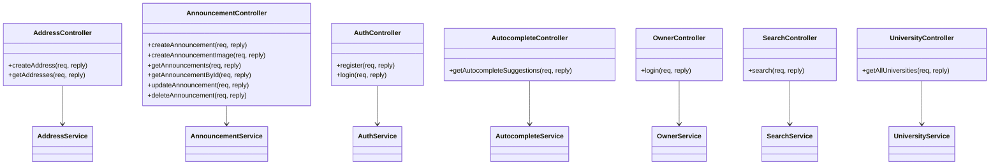

# Diagramas do Projeto UFRoom

Este documento contém dois diagramas UML que representam as principais partes do sistema backend desenvolvido com Fastify.

---

## 1. Diagrama de Classes



## 1. Diagrama de Casos de Uso
```mermaid
   
    usecaseDiagram
    actor "Usuário" as User
    actor "Proprietário" as Owner
    
    User --> (Registrar conta)
    User --> (Login)
    User --> (Buscar anúncios)
    User --> (Visualizar anúncio)
    User --> (Ver universidades)
    User --> (Usar autocomplete de busca)
    
    Owner --> (Login de proprietário)
    Owner --> (Criar anúncio)
    Owner --> (Editar anúncio)
    Owner --> (Excluir anúncio)
